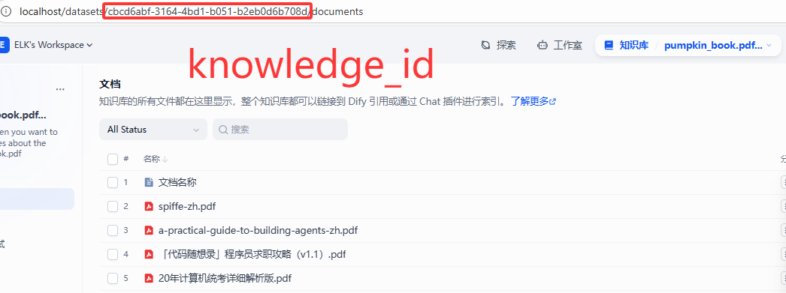

# wechatspider_functions.py 使用指南

## 区分于原版的分支特性
* 做了简单的类封装
* 支持微信文章转为md
* 对所有文章都是抓取后立即保存，而非全部抓取再保存
* 支持加入抓取后自定义hook函数，方便使用RAG处理等进行知识库添加
* 集成Dify知识库API接口
* 通过扫码登录自动获取token和cookie
* 使用.env环境变量配置

## 快速开始

在`.env`文件中填写dify的API_URL，KNOWLEDGE_BASE_ID，API_KEY。可向对应的知识库添加内容。
打开`main.py`，可配置需要抓取的公众号（单个抓取，暂不支持多个抓取）
`dify_knowledgebase.py`中可查看DifyKnowledgeBase类定义，可进行RAG分段配置

## 📋 概述

`wechatspider_functions.py` 提供了简单易用的API来爬取微信公众号文章。

## 🔧 前置配置

### 必须配置的参数

在使用函数库之前，您需要在 `wechatspider_fixed.py` 中配置以下参数：

#### 1. 公众号配置 (FAKEIDS)
```python
self.FAKEIDS = {
    "粤政会计": "MzAxNTM0NzU1Ng==",    # 需要替换为实际的fakeid
    "瑞幸咖啡": "MzUxNDQ2OTc2MQ==",    # 需要替换为实际的fakeid
    "威科先行": "MzA5MDAyODcwMQ=="     # 需要替换为实际的fakeid
}
```

#### 2. 认证信息
```python
self.TOKEN = "1501983514"  # 需要替换为您的实际token
self.COOKIE = "您的完整cookie字符串"  # 需要替换为您的实际cookie
```

### 如何获取这些参数

1. **登录微信公众平台后台**
2. **打开浏览器开发者工具** (F12)
3. **在Network标签中找到微信API请求**
4. **复制请求中的**：
   - `token` 参数
   - `fakeid` 参数（每个公众号对应一个）
   - 完整的 `Cookie` 请求头

## 📚 函数分类与调用

### 1. 单账号下载函数

#### `download_latest(account_name, use_selenium=False)`
下载指定公众号的最新一篇文章

**参数：**
- `account_name` (str, 必填): 公众号名称，必须是FAKEIDS中配置的名称之一
- `use_selenium` (bool, 可选): 是否使用Selenium，默认False（推荐使用requests）

**返回：**
- 成功：返回文章字典，包含标题、内容、发布时间等信息
- 失败：返回None

**调用示例：**
```python
from wechat_spider_functions import download_latest

# 下载威科先行最新文章
article = download_latest("威科先行")
if article:
    print(f"标题: {article['title']}")
    print(f"字数: {article['word_count']}")
    print(f"发布时间: {article['pub_time']}")
else:
    print("下载失败")

# 使用Selenium方法
article = download_latest("威科先行", use_selenium=True)
```

#### `download_recent_week(account_name, max_articles=10, use_selenium=False)`
下载指定公众号最近一周的文章

**参数：**
- `account_name` (str, 必填): 公众号名称
- `max_articles` (int, 可选): 最大文章数量，默认10
- `use_selenium` (bool, 可选): 是否使用Selenium，默认False

**返回：**
- 成功：返回文章列表
- 失败：返回空列表[]

**调用示例：**
```python
# 下载威科先行最近一周文章，最多5篇
articles = download_recent_week("威科先行", max_articles=5)
print(f"共下载 {len(articles)} 篇文章")

for article in articles:
    print(f"- {article['title']} ({article['pub_time']})")
```

#### `download_recent_month(account_name, max_articles=50, use_selenium=False)`
下载指定公众号最近一个月的文章

**参数：**
- `account_name` (str, 必填): 公众号名称
- `max_articles` (int, 可选): 最大文章数量，默认50
- `use_selenium` (bool, 可选): 是否使用Selenium，默认False

**调用示例：**
```python
# 下载瑞幸咖啡最近一个月文章，最多20篇
articles = download_recent_month("瑞幸咖啡", max_articles=20)
```

#### `download_recent_quarter(account_name, max_articles=100, use_selenium=False)`
下载指定公众号最近三个月的文章

**参数：**
- `account_name` (str, 必填): 公众号名称
- `max_articles` (int, 可选): 最大文章数量，默认100
- `use_selenium` (bool, 可选): 是否使用Selenium，默认False

#### `download_custom_period(account_name, days_back, max_articles=50, use_selenium=False)`
下载指定公众号自定义时间段的文章

**参数：**
- `account_name` (str, 必填): 公众号名称
- `days_back` (int, 必填): 向前追溯的天数
- `max_articles` (int, 可选): 最大文章数量，默认50
- `use_selenium` (bool, 可选): 是否使用Selenium，默认False

**调用示例：**
```python
# 下载威科先行最近15天的文章，最多30篇
articles = download_custom_period("威科先行", days_back=15, max_articles=30)
```

### 2. 多账号下载函数

#### `download_all_latest(use_selenium=False)`
下载所有配置公众号的最新文章

**参数：**
- `use_selenium` (bool, 可选): 是否使用Selenium，默认False

**返回：**
- 成功：返回所有文章的列表
- 失败：返回空列表[]

**调用示例：**
```python
# 下载所有公众号最新文章
all_articles = download_all_latest()
print(f"共下载 {len(all_articles)} 个公众号的最新文章")

for article in all_articles:
    print(f"【{article['account_name']}】{article['title']}")
```

#### `download_all_recent_week(max_articles_per_account=10, use_selenium=False)`
下载所有公众号最近一周的文章

**参数：**
- `max_articles_per_account` (int, 可选): 每个公众号最大文章数，默认10
- `use_selenium` (bool, 可选): 是否使用Selenium，默认False

**返回：**
- 成功：返回字典 {公众号名称: [文章列表]}
- 失败：返回空字典{}

**调用示例：**
```python
# 下载所有公众号最近一周文章，每个公众号最多5篇
results = download_all_recent_week(max_articles_per_account=5)

for account_name, articles in results.items():
    print(f"【{account_name}】: {len(articles)} 篇文章")
    for article in articles:
        print(f"  - {article['title']}")
```

#### `download_all_recent_month(max_articles_per_account=50, use_selenium=False)`
下载所有公众号最近一个月的文章

### 3. 特殊功能函数

#### `download_by_keyword(account_name, keyword, days_back=30, max_articles=20, use_selenium=False)`
下载包含特定关键词的文章（在标题中搜索）

**参数：**
- `account_name` (str, 必填): 公众号名称
- `keyword` (str, 必填): 搜索关键词
- `days_back` (int, 可选): 向前追溯天数，默认30
- `max_articles` (int, 可选): 最大文章数量，默认20
- `use_selenium` (bool, 可选): 是否使用Selenium，默认False

**调用示例：**
```python
# 搜索威科先行包含"法律"关键词的文章
legal_articles = download_by_keyword("威科先行", "法律", days_back=30)
print(f"找到 {len(legal_articles)} 篇包含'法律'的文章")

# 搜索瑞幸咖啡包含"咖啡"关键词的文章
coffee_articles = download_by_keyword("瑞幸咖啡", "咖啡", days_back=7)
```

#### `download_top_articles(account_name, top_n=5, days_back=30, use_selenium=False)`
下载指定公众号最近的前N篇文章

**参数：**
- `account_name` (str, 必填): 公众号名称
- `top_n` (int, 可选): 前N篇文章，默认5
- `days_back` (int, 可选): 向前追溯天数，默认30
- `use_selenium` (bool, 可选): 是否使用Selenium，默认False

**调用示例：**
```python
# 下载威科先行最近30天的前3篇文章
top_articles = download_top_articles("威科先行", top_n=3, days_back=30)
```

#### `get_article_summary(account_name, days_back=7)`
获取指定公众号的文章统计信息（不下载内容，速度快）

**参数：**
- `account_name` (str, 必填): 公众号名称
- `days_back` (int, 可选): 向前追溯天数，默认7

**返回：**
- 成功：返回统计字典
- 失败：返回空字典{}

**返回字典包含：**
- `account_name`: 公众号名称
- `days_back`: 统计天数
- `total_articles`: 文章总数
- `latest_article`: 最新文章标题
- `latest_pub_time`: 最新文章发布时间
- `articles`: 文章标题和时间列表

**调用示例：**
```python
# 获取威科先行最近7天的文章统计
summary = get_article_summary("威科先行", days_back=7)
if summary:
    print(f"公众号: {summary['account_name']}")
    print(f"最近{summary['days_back']}天共{summary['total_articles']}篇文章")
    print(f"最新文章: {summary['latest_article']}")
    print(f"发布时间: {summary['latest_pub_time']}")
```

### 4. 批量操作函数

#### `batch_download_latest_all()`
批量下载所有公众号的最新文章

**调用示例：**
```python
# 批量下载所有公众号最新文章
results = batch_download_latest_all()
for account_name, article in results.items():
    if article:
        print(f"【{account_name}】{article['title']}")
    else:
        print(f"【{account_name}】下载失败")
```

#### `batch_download_by_keyword_all(keyword, days_back=30, max_articles_per_account=20)`
批量在所有公众号中搜索包含关键词的文章

**参数：**
- `keyword` (str, 必填): 搜索关键词
- `days_back` (int, 可选): 向前追溯天数，默认30
- `max_articles_per_account` (int, 可选): 每个公众号最大文章数，默认20

**调用示例：**
```python
# 在所有公众号中搜索包含"政策"的文章
results = batch_download_by_keyword_all("政策", days_back=30)
total_found = sum(len(articles) for articles in results.values())
print(f"总共找到 {total_found} 篇包含'政策'的文章")

for account_name, articles in results.items():
    print(f"【{account_name}】: {len(articles)} 篇")
```

#### `batch_get_summaries_all(days_back=7)`
批量获取所有公众号的文章统计

**参数：**
- `days_back` (int, 可选): 向前追溯天数，默认7

**调用示例：**
```python
# 获取所有公众号最近7天的统计
summaries = batch_get_summaries_all(days_back=7)
for account_name, summary in summaries.items():
    print(f"【{account_name}】: {summary['total_articles']} 篇文章")
```

## 📁 文件输出

### 自动文件管理
函数库会自动创建以下文件夹结构：
```
./data/
├── 威科先行/
│   ├── latest_article_20241215_143022.json
│   ├── latest_article_20241215_143022.xlsx
│   └── articles_list_20241215_143022.csv
├── 瑞幸咖啡/
│   └── latest_article_20241215_143025.json
├── 粤政会计/
│   └── recent_articles_20241215_143030.json
└── mixed/
    └── all_latest_20241215_143035.json
```

### 输出格式
- **JSON**: 完整的文章数据（标题、内容、图片链接等）
- **Excel**: 结构化的表格数据，便于分析
- **CSV**: 兼容原始代码格式的简单列表

## 🎯 完整使用示例

### 基础使用流程
```python
from wechat_spider_functions import *

# 1. 首先获取统计信息，确认账号正常
summary = get_article_summary("威科先行", days_back=7)
print(f"威科先行最近7天有 {summary['total_articles']} 篇文章")

# 2. 下载最新文章
latest = download_latest("威科先行")
if latest:
    print(f"成功下载: {latest['title']}")

# 3. 下载最近一周文章
weekly_articles = download_recent_week("威科先行", max_articles=5)
print(f"下载了 {len(weekly_articles)} 篇最近一周的文章")

# 4. 按关键词搜索
law_articles = download_by_keyword("威科先行", "法律", days_back=30)
print(f"找到 {len(law_articles)} 篇包含'法律'的文章")
```

### 批量操作示例
```python
# 获取所有公众号统计
summaries = batch_get_summaries_all(days_back=7)
for account, summary in summaries.items():
    print(f"{account}: {summary['total_articles']} 篇")

# 下载所有公众号最新文章
all_latest = download_all_latest()
print(f"共下载 {len(all_latest)} 个公众号的最新文章")

# 在所有公众号中搜索关键词
results = batch_download_by_keyword_all("咖啡")
total_found = sum(len(articles) for articles in results.values())
print(f"找到 {total_found} 篇包含'咖啡'的文章")
```

## ⚠️ 注意事项

### 必须配置的参数
1. **FAKEIDS**: 必须配置正确的公众号fakeid
2. **TOKEN**: 必须使用有效的token
3. **COOKIE**: 必须使用完整有效的cookie

### 使用建议
1. **首次使用**: 建议先调用`get_article_summary()`测试配置是否正确
2. **网络稳定**: 确保网络连接稳定，避免下载中断
3. **合理延迟**: 函数库已内置防爬虫延迟，请勿频繁调用
4. **数据备份**: 重要数据请及时备份

### 错误处理
```python
# 推荐的错误处理方式
try:
    article = download_latest("威科先行")
    if article:
        print("下载成功")
    else:
        print("下载失败，可能是网络问题或配置错误")
except Exception as e:
    print(f"发生错误: {e}")
```

## 🔧 故障排除

### 常见问题
1. **获取不到文章**: 检查FAKEID、TOKEN、COOKIE是否正确
2. **返回空列表**: 可能是时间范围内没有文章，或者配置有误
3. **下载速度慢**: 正常现象，函数库内置了防爬虫延迟

### 调试建议
```python
# 调试步骤
# 1. 测试配置
summary = get_article_summary("威科先行", days_back=1)
if summary and summary['total_articles'] > 0:
    print("配置正确")
    
    # 2. 测试下载
    article = download_latest("威科先行")
    if article:
        print("下载功能正常")
    else:
        print("下载功能异常")
else:
    print("配置可能有误，请检查FAKEID、TOKEN、COOKIE")
``` 
